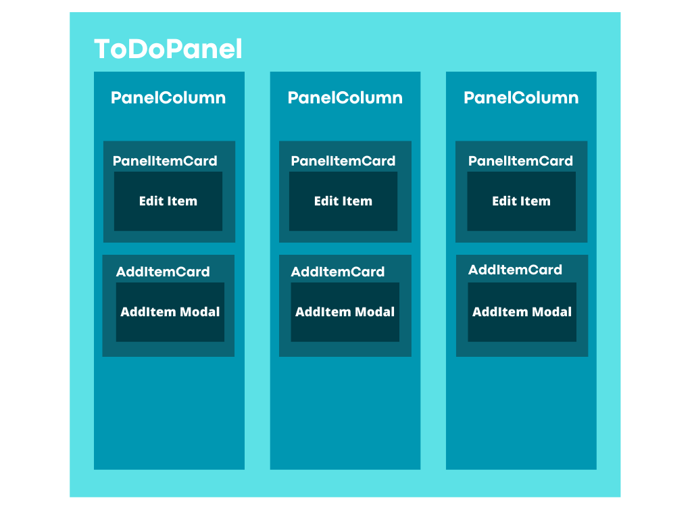

# To do App

## Deployment

Site deployed on the Vercel Platform [https://todoapp-eight-ebon.vercel.app/](https://todoapp-eight-ebon.vercel.app/)

## About the project

### Architecture

The project was made with Next.js for the entire site and its functionalities, prisma was used for the connection with the Supabase database, and the site was deployed in vercel.

### Website flow

### Components

